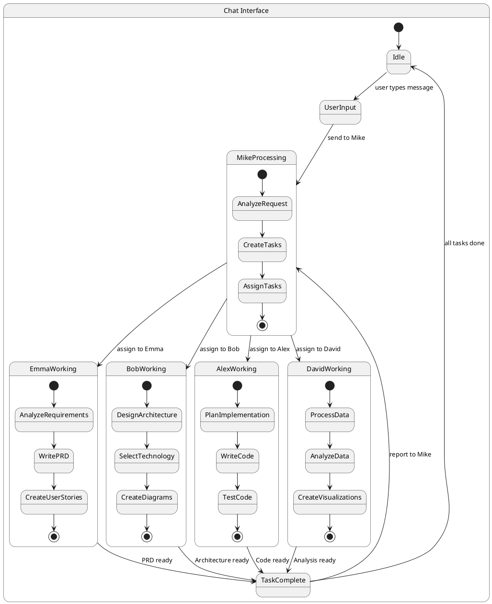
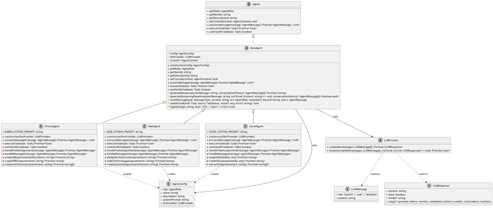
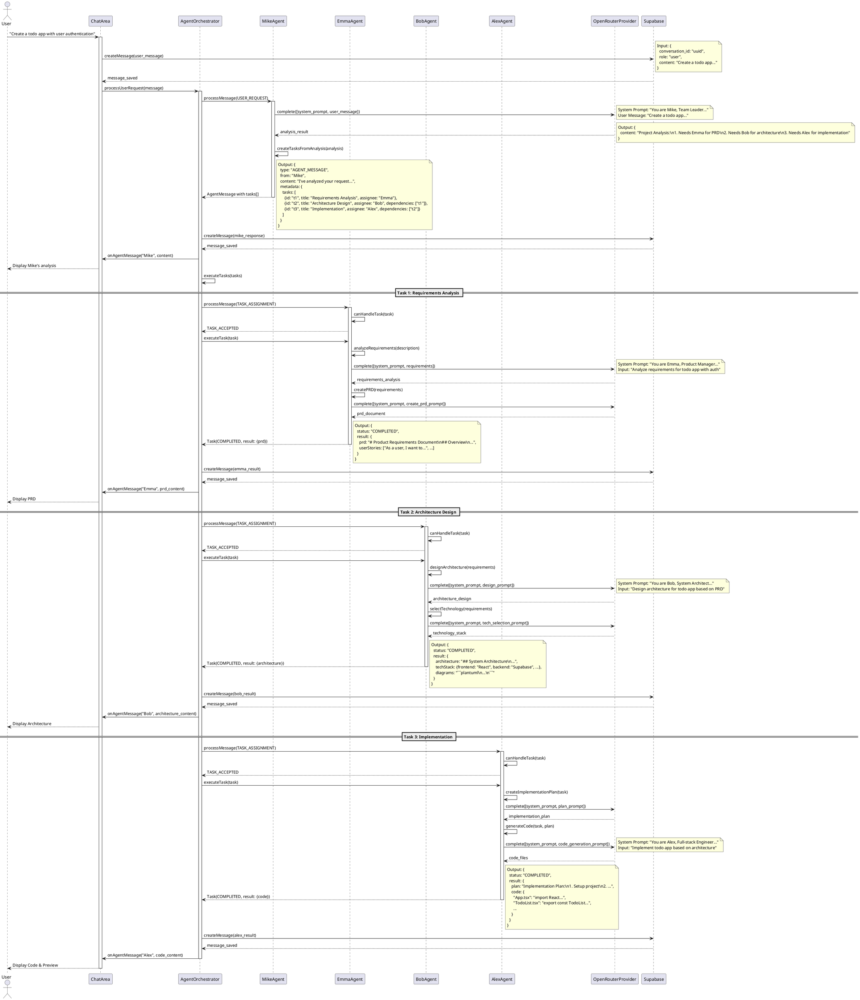
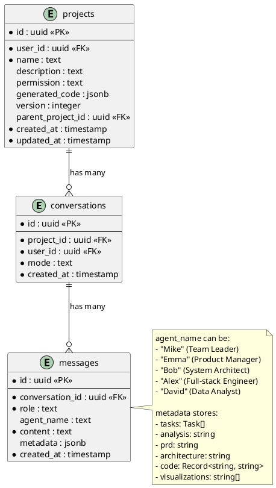

# Agent Implementation System Design

## 1. Implementation Approach

We will implement 3 additional AI agents to complement the existing Mike (Team Leader) and Alex (Full-stack Engineer):

1. **Emma** - Product Manager: Requirements analysis, PRD writing, user stories
2. **Bob** - System Architect: Technical architecture, system design, technology selection
3. **David** - Data Analyst: Data processing, analysis, visualization

### Technical Strategy

- **Inherit from BaseAgent**: All agents extend the abstract BaseAgent class
- **Consistent Architecture**: Follow the same pattern as MikeAgent and AlexAgent
- **OpenRouter Integration**: Use the configured OpenRouter API with Claude 3.5 Sonnet
- **Message Protocol**: Implement standardized agent communication via MessageProtocol
- **LLM Provider Abstraction**: Leverage the existing LLMProvider interface

### Key Design Decisions

1. **System Prompts**: Each agent has a specialized system prompt that defines their expertise and communication style
2. **Task Handling**: Agents implement `canHandleTask()` to determine if they can process specific tasks
3. **Message Processing**: Agents handle different MessageTypes (USER_REQUEST, TASK_ASSIGNMENT, AGENT_QUESTION, etc.)
4. **Error Handling**: Graceful error handling with fallback to asking Mike for clarification

## 2. Main User-Agent Interaction Patterns

### Scenario 1: Requirements Analysis (Emma)
```
User → Mike: "I need a todo app"
Mike → Emma: TASK_ASSIGNMENT (Requirements Analysis)
Emma → LLM: Analyze requirements and create PRD
Emma → Mike: TASK_COMPLETED (PRD document)
Mike → User: Present PRD for approval
```

### Scenario 2: Architecture Design (Bob)
```
Mike → Bob: TASK_ASSIGNMENT (System Architecture Design)
Bob → LLM: Design system architecture
Bob → Mike: TASK_COMPLETED (Architecture document with diagrams)
Mike → Alex: TASK_ASSIGNMENT (Implementation)
```

### Scenario 3: Data Analysis (David)
```
User → Mike: "Analyze this dataset"
Mike → David: TASK_ASSIGNMENT (Data Analysis)
David → LLM: Process and analyze data
David → Mike: TASK_COMPLETED (Analysis report with visualizations)
```

## 3. Architecture

```plantuml
@startuml
package "Agent System" {
  abstract class BaseAgent {
    #config: AgentConfig
    #llmProvider: LLMProvider
    #context: AgentContext
    +processMessage(message: AgentMessage): Promise<AgentMessage | null>
    +executeTask(task: Task): Promise<Task>
    +canHandleTask(task: Task): boolean
    #generateResponse(userMessage: string): Promise<string>
  }
  
  class MikeAgent extends BaseAgent {
    -handleUserRequest(message: AgentMessage): Promise<AgentMessage>
    -handleTaskCompletion(message: AgentMessage): Promise<AgentMessage>
    -createTasksFromAnalysis(analysis: string): Task[]
  }
  
  class EmmaAgent extends BaseAgent {
    -handleTaskAssignment(message: AgentMessage): Promise<AgentMessage>
    -analyzeRequirements(description: string): Promise<string>
    -createPRD(requirements: string): Promise<string>
    -createUserStories(requirements: string): Promise<string[]>
  }
  
  class BobAgent extends BaseAgent {
    -handleTaskAssignment(message: AgentMessage): Promise<AgentMessage>
    -designArchitecture(requirements: string): Promise<string>
    -selectTechnology(requirements: string): Promise<string>
    -createSystemDiagram(architecture: string): Promise<string>
  }
  
  class AlexAgent extends BaseAgent {
    -handleTaskAssignment(message: AgentMessage): Promise<AgentMessage>
    -createImplementationPlan(task: Task): Promise<string>
    -generateCode(task: Task, plan: string): Promise<string>
  }
  
  class DavidAgent extends BaseAgent {
    -handleTaskAssignment(message: AgentMessage): Promise<AgentMessage>
    -analyzeData(data: any): Promise<string>
    -createVisualization(data: any): Promise<string>
    -extractInsights(analysis: string): Promise<string[]>
  }
  
  class AgentOrchestrator {
    -agents: Map<AgentRole, BaseAgent>
    -llmProvider: LLMProvider
    -messageHistory: AgentMessage[]
    -activeTasks: Map<string, Task>
    +processUserRequest(message: string): Promise<void>
    -executeTasks(tasks: Task[]): Promise<void>
    -executeTask(task: Task): Promise<void>
  }
}

package "LLM Integration" {
  interface LLMProvider {
    +complete(messages: LLMMessage[]): Promise<LLMResponse>
    +streamComplete(messages: LLMMessage[], onChunk: Function): Promise<void>
  }
  
  class OpenRouterProvider implements LLMProvider {
    -apiKey: string
    -model: string
    -baseURL: string
  }
}

package "Communication Protocol" {
  enum AgentRole {
    MIKE
    EMMA
    BOB
    ALEX
    DAVID
    USER
    SYSTEM
  }
  
  enum MessageType {
    USER_REQUEST
    AGENT_MESSAGE
    TASK_ASSIGNMENT
    TASK_ACCEPTED
    TASK_COMPLETED
    AGENT_QUESTION
  }
  
  class AgentMessage {
    +id: string
    +type: MessageType
    +from: AgentRole
    +to: AgentRole
    +content: string
    +metadata: Record<string, any>
    +timestamp: Date
  }
  
  class Task {
    +id: string
    +title: string
    +description: string
    +assignee: AgentRole
    +status: TaskStatus
    +priority: string
    +dependencies: string[]
    +result: any
  }
}

AgentOrchestrator --> BaseAgent : manages
BaseAgent --> LLMProvider : uses
BaseAgent --> AgentMessage : sends/receives
BaseAgent --> Task : executes
AgentOrchestrator --> OpenRouterProvider : creates
@enduml
```



## 4. UI Navigation Flow



## 5. Class Diagram



## 6. Sequence Diagram



## 7. Database ER Diagram

The existing database schema already supports the agent system:



## 8. Anything UNCLEAR

### Clarifications Needed

1. **Agent Priority**: When multiple agents can handle a task, which one should take priority?
   - **Assumption**: Mike's task assignment is authoritative

2. **Streaming vs Non-streaming**: Should all agents support streaming responses?
   - **Assumption**: Start with non-streaming, add streaming in Phase 2

3. **Error Recovery**: How should agents handle LLM API failures?
   - **Assumption**: Retry 3 times, then ask Mike for help

4. **Task Dependencies**: How to handle circular dependencies?
   - **Assumption**: Mike's task creation logic prevents circular dependencies

5. **Data Visualization**: Should David generate actual chart code or just descriptions?
   - **Assumption**: Start with descriptions, add actual chart generation in Phase 2

## 9. Implementation Phases

### Phase 1: Core Agent Implementation (Week 1)
- Implement EmmaAgent, BobAgent, DavidAgent classes
- Define system prompts for each agent
- Implement basic message handling and task execution
- Add agents to MessageProtocol enum

### Phase 2: Orchestrator Integration (Week 1)
- Update AgentOrchestrator to register new agents
- Implement task routing logic
- Test agent collaboration flow
- Update MikeAgent to create tasks for new agents

### Phase 3: Testing & Refinement (Week 2)
- Unit tests for each agent
- Integration tests for agent collaboration
- Prompt optimization based on test results
- Error handling improvements

### Phase 4: UI Integration (Week 2)
- Update ChatArea to display agent-specific messages
- Add agent status indicators
- Implement task progress visualization
- Add agent selection UI (if needed)

## 10. Success Criteria

- [ ] All 3 new agents (Emma, Bob, David) implemented and registered
- [ ] Agents can handle their respective task types
- [ ] Mike can successfully delegate tasks to appropriate agents
- [ ] Agent responses are saved to database with correct agent_name
- [ ] UI displays agent messages with correct avatars
- [ ] End-to-end flow works: User → Mike → Emma/Bob/David → Alex → Result
- [ ] Error handling works gracefully
- [ ] Code follows existing patterns and conventions