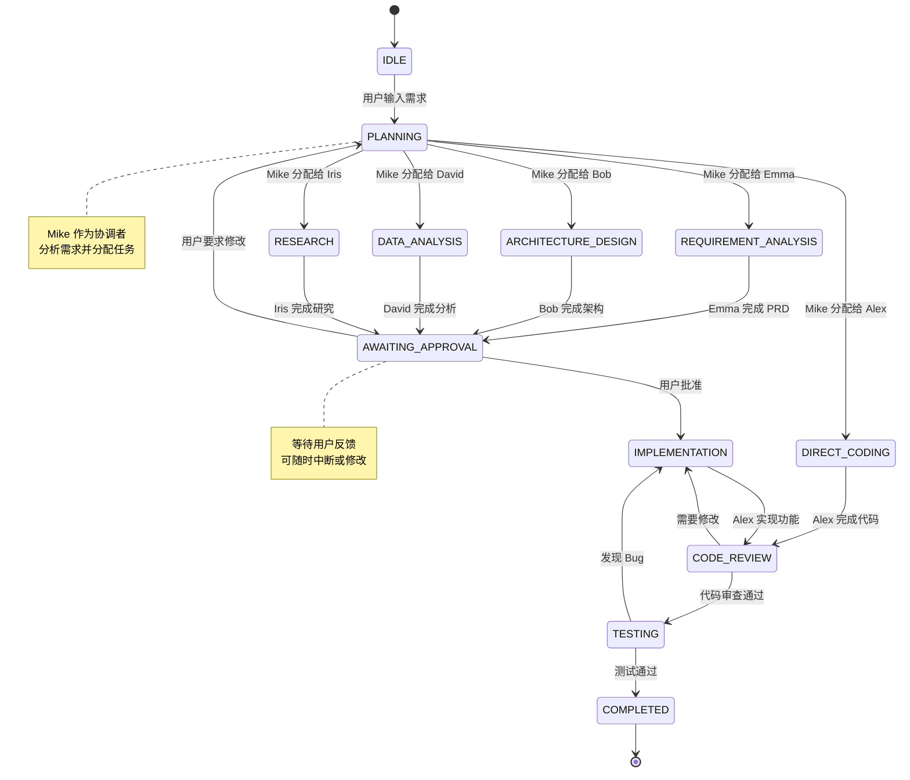
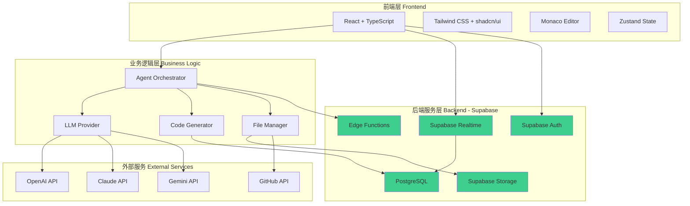
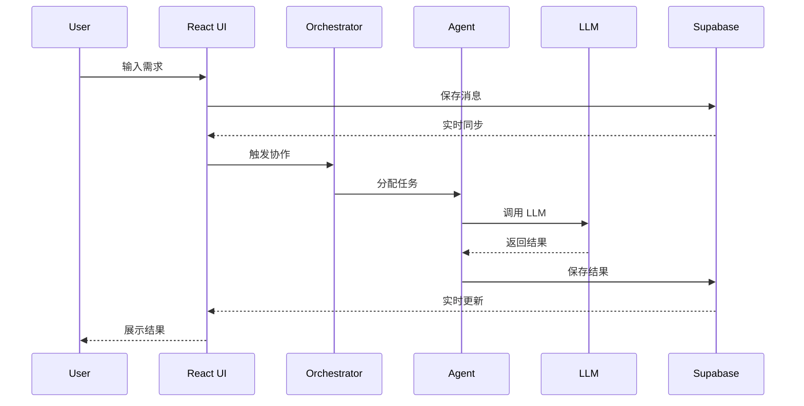

# MGX Demo - 开发路线图 v2.1（全面增强版）

## 版本说明
本文档基于 v2.0 版本，根据 PRD 审查建议进行全面优化，采用**方案B（Supabase优先）**架构，补充了认证系统、编辑器功能、测试策略、安全性措施等关键内容。

---

## 1. 项目概览

### 1.1 产品定位
MGX Demo 是一个 AI 驱动的多智能体协作平台演示项目，旨在展示如何通过自然语言指令，让多个 AI Agent 协同完成复杂的软件开发任务。

### 1.2 技术栈（方案B - Supabase优先）
- **前端**: React 18 + TypeScript + Vite + Tailwind CSS + shadcn/ui
- **后端**: Supabase（PostgreSQL + Auth + Storage + Edge Functions + Realtime）
- **状态管理**: Zustand
- **代码编辑器**: Monaco Editor
- **AI 服务**: 多模型支持（OpenAI GPT-4、Claude、Gemini、DeepSeek）
- **部署**: Vercel（前端）+ Supabase（后端）

**技术栈说明**：
- ✅ 使用 TypeScript 提供类型安全
- ✅ 使用 shadcn/ui 作为 UI 组件库
- ✅ 使用 Supabase 作为主要后端服务（认证、数据库、存储、实时通信）
- ✅ 减少自建后端工作量，专注于 AI 协作逻辑

### 1.3 核心智能体
- **Mike**: 项目负责人，负责任务分配和协调
- **Emma**: 产品经理，负责需求分析和 PRD 文档编写
- **Bob**: 系统架构师，负责技术方案设计
- **Alex**: 全栈工程师，负责前端和代码实现
- **David**: 数据分析师，负责数据处理和可视化
- **Iris**: 深度研究员，负责信息检索和专业报告生成

---

## 2. 开发里程碑

### M1: 项目初始化与用户认证 (Week 1-2)

#### M1.1 项目脚手架搭建

| 任务ID | 任务名称 | 负责人 | 优先级 | 关键产出 |
|--------|----------|--------|--------|----------|
| M1.1.1 | 前端项目初始化 | Alex | P0 | Vite + React + TypeScript 项目 |
| M1.1.2 | Tailwind CSS 配置 | Alex | P0 | tailwind.config.js |
| M1.1.3 | shadcn/ui 集成 | Alex | P0 | components/ui 目录 |
| M1.1.4 | 项目目录结构 | Alex | P0 | 标准化文件组织 |
| M1.1.5 | ESLint + Prettier | Alex | P0 | 代码规范配置 |

#### M1.2 Supabase 项目配置

| 任务ID | 任务名称 | 负责人 | 优先级 | 关键产出 |
|--------|----------|--------|--------|----------|
| M1.2.1 | Supabase 项目创建 | Bob | P0 | Supabase 项目实例 |
| M1.2.2 | 数据库 Schema 设计 | Bob | P0 | 表结构定义文档 |
| M1.2.3 | Supabase 客户端配置 | Bob | P0 | supabaseClient.ts |
| M1.2.4 | 环境变量配置 | Bob | P0 | .env.example |

**数据库表结构**：
```sql
-- users 表（由 Supabase Auth 自动管理）
-- 扩展字段通过 profiles 表

-- profiles 表
CREATE TABLE profiles (
  id UUID REFERENCES auth.users PRIMARY KEY,
  username TEXT UNIQUE,
  avatar_url TEXT,
  credits INTEGER DEFAULT 100,
  subscription_tier TEXT DEFAULT 'free',
  created_at TIMESTAMP WITH TIME ZONE DEFAULT NOW(),
  updated_at TIMESTAMP WITH TIME ZONE DEFAULT NOW()
);

-- projects 表
CREATE TABLE projects (
  id UUID PRIMARY KEY DEFAULT uuid_generate_v4(),
  user_id UUID REFERENCES auth.users NOT NULL,
  name TEXT NOT NULL,
  description TEXT,
  permission TEXT DEFAULT 'private', -- private, link_only, public
  generated_code JSONB, -- {html, css, js, files}
  version INTEGER DEFAULT 1,
  parent_project_id UUID REFERENCES projects,
  created_at TIMESTAMP WITH TIME ZONE DEFAULT NOW(),
  updated_at TIMESTAMP WITH TIME ZONE DEFAULT NOW()
);

-- conversations 表
CREATE TABLE conversations (
  id UUID PRIMARY KEY DEFAULT uuid_generate_v4(),
  project_id UUID REFERENCES projects NOT NULL,
  user_id UUID REFERENCES auth.users NOT NULL,
  mode TEXT DEFAULT 'team', -- team, engineer, research, race
  created_at TIMESTAMP WITH TIME ZONE DEFAULT NOW()
);

-- messages 表
CREATE TABLE messages (
  id UUID PRIMARY KEY DEFAULT uuid_generate_v4(),
  conversation_id UUID REFERENCES conversations NOT NULL,
  role TEXT NOT NULL, -- user, assistant, system
  agent_name TEXT, -- Mike, Emma, Bob, Alex, David, Iris
  content TEXT NOT NULL,
  metadata JSONB, -- 额外信息（如代码块、文件引用等）
  created_at TIMESTAMP WITH TIME ZONE DEFAULT NOW()
);

-- files 表
CREATE TABLE files (
  id UUID PRIMARY KEY DEFAULT uuid_generate_v4(),
  project_id UUID REFERENCES projects NOT NULL,
  user_id UUID REFERENCES auth.users NOT NULL,
  name TEXT NOT NULL,
  path TEXT NOT NULL,
  content TEXT,
  storage_path TEXT, -- Supabase Storage 路径
  size INTEGER,
  mime_type TEXT,
  created_at TIMESTAMP WITH TIME ZONE DEFAULT NOW()
);

-- versions 表（用于 Remix 和版本控制）
CREATE TABLE versions (
  id UUID PRIMARY KEY DEFAULT uuid_generate_v4(),
  project_id UUID REFERENCES projects NOT NULL,
  version_number INTEGER NOT NULL,
  snapshot JSONB NOT NULL, -- 完整的项目快照
  description TEXT,
  created_at TIMESTAMP WITH TIME ZONE DEFAULT NOW()
);
```

#### M1.3 用户认证系统（新增）

| 任务ID | 任务名称 | 负责人 | 优先级 | 关键产出 |
|--------|----------|--------|--------|----------|
| M1.3.1 | Supabase Auth 集成 | Bob | P0 | 认证服务配置 |
| M1.3.2 | 登录/注册页面 | Alex | P0 | Auth UI 组件 |
| M1.3.3 | OAuth 集成（GitHub） | Bob | P0 | 社交登录功能 |
| M1.3.4 | 会话管理 | Bob | P0 | useAuth Hook |
| M1.3.5 | 权限中间件 | Bob | P0 | 路由守卫 |

#### M1.4 基础 UI 框架

| 任务ID | 任务名称 | 负责人 | 优先级 | 关键产出 |
|--------|----------|--------|--------|----------|
| M1.4.1 | 工作区布局 | Alex | P0 | WorkspaceLayout.tsx |
| M1.4.2 | 侧边栏组件 | Alex | P0 | Sidebar.tsx |
| M1.4.3 | 顶部导航栏 | Alex | P0 | Navbar.tsx |
| M1.4.4 | 响应式设计 | Alex | P0 | 移动端适配 |

#### M1.5 开发规范

| 任务ID | 任务名称 | 负责人 | 优先级 | 关键产出 |
|--------|----------|--------|--------|----------|
| M1.5.1 | Git 工作流规范 | Mike | P0 | CONTRIBUTING.md |
| M1.5.2 | 代码审查流程 | Mike | P0 | PR 模板 |
| M1.5.3 | CI/CD 配置 | Mike | P1 | GitHub Actions |

**里程碑目标**: 完成项目基础架构和用户认证，团队成员可以开始并行开发。

**测试要求**：
- [ ] 用户可以通过邮箱注册/登录
- [ ] 用户可以通过 GitHub OAuth 登录
- [ ] 登录状态持久化
- [ ] 未登录用户访问受保护路由时重定向到登录页

---

### M2: 核心聊天功能 (Week 3-4)

#### M2.1 聊天界面

| 任务ID | 任务名称 | 负责人 | 优先级 | 关键产出 |
|--------|----------|--------|--------|----------|
| M2.1.1 | 聊天输入框组件 | Alex | P0 | ChatInput.tsx |
| M2.1.2 | 消息列表组件 | Alex | P0 | MessageList.tsx |
| M2.1.3 | 消息气泡组件 | Alex | P0 | MessageBubble.tsx |
| M2.1.4 | Agent 头像显示 | Alex | P0 | AgentAvatar.tsx |
| M2.1.5 | Markdown 渲染 | Alex | P0 | react-markdown 集成 |
| M2.1.6 | 代码块高亮 | Alex | P0 | Prism.js 集成 |
| M2.1.7 | 文件上传功能 | Alex | P1 | FileUpload.tsx |
| M2.1.8 | 图片粘贴功能 | Alex | P1 | 剪贴板 API |

#### M2.2 智能体系统

| 任务ID | 任务名称 | 负责人 | 优先级 | 关键产出 |
|--------|----------|--------|--------|----------|
| M2.2.1 | Agent 基类设计 | Bob | P0 | BaseAgent.ts |
| M2.2.2 | Mike Agent 实现 | Bob | P0 | MikeAgent.ts |
| M2.2.3 | Emma Agent 实现 | Bob | P0 | EmmaAgent.ts |
| M2.2.4 | Bob Agent 实现 | Bob | P0 | BobAgent.ts |
| M2.2.5 | Alex Agent 实现 | Bob | P0 | AlexAgent.ts |
| M2.2.6 | David Agent 实现 | Bob | P1 | DavidAgent.ts |
| M2.2.7 | Iris Agent 实现 | Bob | P1 | IrisAgent.ts |
| M2.2.8 | Agent 通信协议 | Bob | P0 | MessageProtocol.ts |

#### M2.3 LLM 集成

| 任务ID | 任务名称 | 负责人 | 优先级 | 关键产出 |
|--------|----------|--------|--------|----------|
| M2.3.1 | LLM 抽象层 | Bob | P0 | LLMProvider.ts |
| M2.3.2 | OpenAI 集成 | Bob | P0 | OpenAIProvider.ts |
| M2.3.3 | Claude 集成 | Bob | P1 | ClaudeProvider.ts |
| M2.3.4 | Gemini 集成 | Bob | P1 | GeminiProvider.ts |
| M2.3.5 | 流式响应处理 | Bob | P0 | StreamHandler.ts |
| M2.3.6 | 错误重试机制 | Bob | P0 | RetryLogic.ts |

#### M2.4 实时通信（Supabase Realtime）

| 任务ID | 任务名称 | 负责人 | 优先级 | 关键产出 |
|--------|----------|--------|--------|----------|
| M2.4.1 | Supabase Realtime 配置 | Bob | P0 | Realtime 订阅设置 |
| M2.4.2 | 消息实时同步 | Bob | P0 | useRealtimeMessages Hook |
| M2.4.3 | 在线状态显示 | Alex | P1 | PresenceIndicator.tsx |
| M2.4.4 | 断线重连处理 | Bob | P1 | Reconnection 逻辑 |

#### M2.5 数据持久化（Supabase）

| 任务ID | 任务名称 | 负责人 | 优先级 | 关键产出 |
|--------|----------|--------|--------|----------|
| M2.5.1 | 会话创建与管理 | Bob | P0 | Conversation API |
| M2.5.2 | 消息存储 | Bob | P0 | Message API |
| M2.5.3 | 项目数据存储 | Bob | P0 | Project API |
| M2.5.4 | 文件存储（Supabase Storage） | Bob | P0 | File Upload API |

**里程碑目标**: 完成核心聊天功能，用户可以与单个 AI Agent（工程师模式）进行基本交互。

**测试要求**：
- [ ] 用户可以发送消息并收到 AI 回复
- [ ] 消息支持 Markdown 和代码块渲染
- [ ] 消息实时同步到数据库
- [ ] 支持文件上传和图片粘贴
- [ ] 断线重连后消息不丢失

---

### M3: 代码编辑器与预览 (Week 5-6)

#### M3.1 Monaco Editor 集成（新增）

| 任务ID | 任务名称 | 负责人 | 优先级 | 关键产出 |
|--------|----------|--------|--------|----------|
| M3.1.1 | Monaco Editor 安装 | Alex | P0 | @monaco-editor/react |
| M3.1.2 | 代码编辑器组件 | Alex | P0 | CodeEditor.tsx |
| M3.1.3 | 多语言支持 | Alex | P0 | 语法高亮配置 |
| M3.1.4 | 代码自动补全 | Alex | P1 | IntelliSense 配置 |
| M3.1.5 | 代码格式化 | Alex | P1 | Prettier 集成 |
| M3.1.6 | 代码 Diff 视图 | Alex | P1 | DiffEditor.tsx |

#### M3.2 文件管理系统（新增）

| 任务ID | 任务名称 | 负责人 | 优先级 | 关键产出 |
|--------|----------|--------|--------|----------|
| M3.2.1 | 文件树组件 | Alex | P0 | FileTree.tsx |
| M3.2.2 | 文件 CRUD 操作 | Bob | P0 | File API |
| M3.2.3 | 文件搜索功能 | Alex | P1 | FileSearch.tsx |
| M3.2.4 | 文件夹管理 | Alex | P1 | Folder Operations |
| M3.2.5 | 文件拖拽排序 | Alex | P2 | Drag & Drop |

#### M3.3 应用预览（App Viewer）

| 任务ID | 任务名称 | 负责人 | 优先级 | 关键产出 |
|--------|----------|--------|--------|----------|
| M3.3.1 | iframe 预览组件 | Alex | P0 | AppViewer.tsx |
| M3.3.2 | 代码注入与渲染 | Alex | P0 | Code Injection 逻辑 |
| M3.3.3 | 热重载功能 | Alex | P0 | HMR 实现 |
| M3.3.4 | 响应式预览 | Alex | P1 | 设备视图切换 |
| M3.3.5 | 控制台输出 | Alex | P1 | Console.tsx |
| M3.3.6 | 错误捕获 | Alex | P1 | Error Boundary |

#### M3.4 Terminal 集成（新增）

| 任务ID | 任务名称 | 负责人 | 优先级 | 关键产出 |
|--------|----------|--------|--------|----------|
| M3.4.1 | Terminal 组件 | Alex | P0 | Terminal.tsx |
| M3.4.2 | 命令执行模拟 | Bob | P0 | Command Executor |
| M3.4.3 | 输出流显示 | Alex | P0 | Output Stream UI |
| M3.4.4 | 命令历史记录 | Alex | P1 | History Management |

#### M3.5 代码生成与同步

| 任务ID | 任务名称 | 负责人 | 优先级 | 关键产出 |
|--------|----------|--------|--------|----------|
| M3.5.1 | 代码解析逻辑 | Bob | P0 | Code Parser |
| M3.5.2 | 编辑器与数据库同步 | Bob | P0 | Sync Logic |
| M3.5.3 | 冲突检测与解决 | Bob | P1 | Conflict Resolution |

**里程碑目标**: 完成代码编辑器、文件管理和应用预览功能。

**测试要求**：
- [ ] 用户可以在编辑器中查看和编辑代码
- [ ] 代码修改实时同步到预览
- [ ] 文件树正确显示项目结构
- [ ] Terminal 可以显示执行过程
- [ ] 预览支持多设备视图切换

---

### M4: 多智能体协作 (Week 7-8)

#### M4.1 模式切换

| 任务ID | 任务名称 | 负责人 | 优先级 | 关键产出 |
|--------|----------|--------|--------|----------|
| M4.1.1 | 模式切换 UI | Alex | P0 | ModeSwitcher.tsx |
| M4.1.2 | 工程师模式 | Bob | P0 | Engineer Mode Logic |
| M4.1.3 | 团队模式 | Bob | P0 | Team Mode Logic |
| M4.1.4 | 深度研究模式 | Bob | P1 | Research Mode Logic |
| M4.1.5 | 竞速模式 | Bob | P2 | Race Mode Logic |

#### M4.2 智能体状态机（Orchestrator）

| 任务ID | 任务名称 | 负责人 | 优先级 | 关键产出 |
|--------|----------|--------|--------|----------|
| M4.2.1 | 状态机设计 | Bob | P0 | State Machine 架构图 |
| M4.2.2 | 状态定义 | Bob | P0 | AgentStates.ts |
| M4.2.3 | 状态转换逻辑 | Bob | P0 | StateTransition.ts |
| M4.2.4 | 任务路由器 | Bob | P0 | TaskRouter.ts |
| M4.2.5 | 循环检测与处理 | Bob | P1 | Loop Detection |
| M4.2.6 | 用户中断处理 | Bob | P1 | Interrupt Handler |

**状态机流程图**：


#### M4.3 协作可视化

| 任务ID | 任务名称 | 负责人 | 优先级 | 关键产出 |
|--------|----------|--------|--------|----------|
| M4.3.1 | Agent 状态显示 | Alex | P0 | AgentStatus.tsx |
| M4.3.2 | 协作流程图 | Alex | P1 | CollaborationFlow.tsx |
| M4.3.3 | 任务进度追踪 | Alex | P1 | ProgressTracker.tsx |

**里程碑目标**: 实现多智能体协作，支持复杂任务的自动分解和执行。

**测试要求**：
- [ ] 用户可以在不同模式间切换
- [ ] 团队模式下多个 Agent 协同工作
- [ ] 状态机正确处理任务路由
- [ ] 用户可以随时中断协作流程
- [ ] 协作过程可视化展示

---

### M5: 高级功能与集成 (Week 9-10)

#### M5.1 版本控制（Remix & Versions）

| 任务ID | 任务名称 | 负责人 | 优先级 | 关键产出 |
|--------|----------|--------|--------|----------|
| M5.1.1 | Remix 功能 | Bob | P0 | Remix API |
| M5.1.2 | 版本快照 | Bob | P0 | Snapshot Logic |
| M5.1.3 | 版本历史 UI | Alex | P0 | VersionHistory.tsx |
| M5.1.4 | 版本对比 | Alex | P1 | VersionDiff.tsx |
| M5.1.5 | 版本回滚 | Bob | P1 | Rollback API |
| M5.1.6 | 版本切换 | Alex | P1 | Version Switcher UI |

#### M5.2 Bug Fix 功能

| 任务ID | 任务名称 | 负责人 | 优先级 | 关键产出 |
|--------|----------|--------|--------|----------|
| M5.2.1 | 错误检测 | Bob | P0 | Error Detection |
| M5.2.2 | Bug Report 生成 | Bob | P0 | Bug Reporter |
| M5.2.3 | Fix All 按钮 | Alex | P0 | FixAll UI |
| M5.2.4 | 自动修复逻辑 | Bob | P0 | Auto Fix Logic |
| M5.2.5 | 修复历史记录 | Alex | P1 | Fix History UI |

#### M5.3 分享与发布

| 任务ID | 任务名称 | 负责人 | 优先级 | 关键产出 |
|--------|----------|--------|--------|----------|
| M5.3.1 | 分享菜单 | Alex | P0 | ShareModal.tsx |
| M5.3.2 | 权限设置 | Bob | P0 | Permission API |
| M5.3.3 | 链接生成 | Bob | P0 | Share Link Generator |
| M5.3.4 | 项目导出 | Bob | P0 | Export to ZIP |
| M5.3.5 | 发布功能 | Bob | P0 | Publish API |
| M5.3.6 | 社交分享 | Alex | P1 | Social Share Buttons |

#### M5.4 Supabase 深度集成

| 任务ID | 任务名称 | 负责人 | 优先级 | 关键产出 |
|--------|----------|--------|--------|----------|
| M5.4.1 | Supabase 连接 UI | Alex | P0 | Supabase Connect Button |
| M5.4.2 | 数据库配置界面 | Alex | P0 | Database Config UI |
| M5.4.3 | Auth 代码生成 | Bob | P0 | Auth Code Templates |
| M5.4.4 | CRUD 代码生成 | Bob | P0 | CRUD Code Templates |
| M5.4.5 | Edge Functions 支持 | Bob | P1 | Edge Function Templates |

#### M5.5 GitHub 集成

| 任务ID | 任务名称 | 负责人 | 优先级 | 关键产出 |
|--------|----------|--------|--------|----------|
| M5.5.1 | GitHub OAuth | Bob | P0 | GitHub Auth |
| M5.5.2 | 仓库选择 | Alex | P0 | Repo Selector UI |
| M5.5.3 | 代码推送 | Bob | P0 | Push to GitHub API |
| M5.5.4 | Commit 管理 | Alex | P1 | Commit History UI |

**里程碑目标**: 完成高级功能，提升用户体验和协作效率。

**测试要求**：
- [ ] 用户可以 Remix 任何公开项目
- [ ] 版本历史正确记录
- [ ] Bug Fix 功能可以自动检测和修复错误
- [ ] 用户可以分享和发布项目
- [ ] Supabase 集成功能正常工作
- [ ] GitHub 推送功能正常

---

### M6: 测试与优化 (Week 11-12)

#### M6.1 单元测试（新增）

| 任务ID | 任务名称 | 负责人 | 优先级 | 关键产出 |
|--------|----------|--------|--------|----------|
| M6.1.1 | 测试框架搭建 | Alex | P0 | Vitest + Testing Library |
| M6.1.2 | 组件单元测试 | Alex | P0 | UI 组件测试用例 |
| M6.1.3 | 工具函数测试 | Alex | P0 | Utils 测试用例 |
| M6.1.4 | Agent 逻辑测试 | Bob | P0 | Agent 测试用例 |
| M6.1.5 | 测试覆盖率 > 80% | Alex | P0 | Coverage Report |

#### M6.2 集成测试（新增）

| 任务ID | 任务名称 | 负责人 | 优先级 | 关键产出 |
|--------|----------|--------|--------|----------|
| M6.2.1 | API 集成测试 | Bob | P0 | API 测试套件 |
| M6.2.2 | Supabase 集成测试 | Bob | P0 | Database 测试 |
| M6.2.3 | LLM 集成测试 | Bob | P1 | Mock LLM 测试 |

#### M6.3 E2E 测试（新增）

| 任务ID | 任务名称 | 负责人 | 优先级 | 关键产出 |
|--------|----------|--------|--------|----------|
| M6.3.1 | Playwright 配置 | Alex | P1 | E2E 测试框架 |
| M6.3.2 | 关键流程测试 | Alex | P1 | 用户旅程测试 |
| M6.3.3 | 跨浏览器测试 | Alex | P2 | 兼容性测试 |

#### M6.4 安全性加固（新增）

| 任务ID | 任务名称 | 负责人 | 优先级 | 关键产出 |
|--------|----------|--------|--------|----------|
| M6.4.1 | Supabase RLS 规则 | Bob | P0 | Row Level Security 配置 |
| M6.4.2 | XSS 防护 | Bob | P0 | Content Security Policy |
| M6.4.3 | CSRF 防护 | Bob | P0 | CSRF Token |
| M6.4.4 | API 速率限制 | Bob | P0 | Rate Limiting |
| M6.4.5 | 敏感数据加密 | Bob | P0 | Encryption Logic |
| M6.4.6 | 安全审计 | Bob | P0 | Security Audit Report |

#### M6.5 性能优化

| 任务ID | 任务名称 | 负责人 | 优先级 | 关键产出 |
|--------|----------|--------|--------|----------|
| M6.5.1 | 代码分割 | Alex | P0 | Lazy Loading |
| M6.5.2 | 图片优化 | Alex | P0 | Image Optimization |
| M6.5.3 | 缓存策略 | Bob | P0 | Cache Configuration |
| M6.5.4 | 消息分页 | Bob | P0 | Pagination Logic |
| M6.5.5 | 性能监控 | David | P1 | Performance Dashboard |

#### M6.6 监控与日志（新增）

| 任务ID | 任务名称 | 负责人 | 优先级 | 关键产出 |
|--------|----------|--------|--------|----------|
| M6.6.1 | Sentry 集成 | Mike | P0 | 错误追踪 |
| M6.6.2 | 性能监控 | David | P1 | Performance Monitoring |
| M6.6.3 | 用户行为分析 | David | P1 | Analytics Dashboard |
| M6.6.4 | LLM 成本追踪 | David | P0 | Cost Monitoring |

**里程碑目标**: 完成测试、安全加固和性能优化，确保系统稳定性。

**测试要求**：
- [ ] 单元测试覆盖率 > 80%
- [ ] 所有 API 端点有集成测试
- [ ] 关键用户流程有 E2E 测试
- [ ] 通过安全审计
- [ ] 首屏加载时间 < 2s
- [ ] API 响应时间 < 500ms

---

### M7: 文档与发布 (Week 13-14)

#### M7.1 用户文档

| 任务ID | 任务名称 | 负责人 | 优先级 | 关键产出 |
|--------|----------|--------|--------|----------|
| M7.1.1 | 快速开始指南 | Emma | P0 | Quick Start Guide |
| M7.1.2 | 功能介绍文档 | Emma | P0 | Feature Docs |
| M7.1.3 | FAQ 文档 | Emma | P0 | FAQ.md |
| M7.1.4 | 视频教程 | Emma | P1 | Tutorial Videos |
| M7.1.5 | 用户引导（Onboarding） | Alex | P0 | Onboarding Flow |

#### M7.2 开发者文档

| 任务ID | 任务名称 | 负责人 | 优先级 | 关键产出 |
|--------|----------|--------|--------|----------|
| M7.2.1 | API 文档 | Bob | P0 | API Reference |
| M7.2.2 | 架构文档 | Bob | P0 | Architecture Guide |
| M7.2.3 | 开发指南 | Bob | P0 | DEVELOPER.md |
| M7.2.4 | 贡献指南 | Mike | P0 | CONTRIBUTING.md |

#### M7.3 国际化（新增）

| 任务ID | 任务名称 | 负责人 | 优先级 | 关键产出 |
|--------|----------|--------|--------|----------|
| M7.3.1 | i18n 框架集成 | Alex | P1 | react-i18next |
| M7.3.2 | 中文翻译 | Emma | P1 | zh-CN.json |
| M7.3.3 | 英文翻译 | Emma | P1 | en-US.json |
| M7.3.4 | 语言切换 UI | Alex | P1 | Language Switcher |

#### M7.4 社区建设

| 任务ID | 任务名称 | 负责人 | 优先级 | 关键产出 |
|--------|----------|--------|--------|----------|
| M7.4.1 | Discord 服务器 | Emma | P1 | Community Server |
| M7.4.2 | GitHub Discussions | Emma | P1 | Discussion Forum |
| M7.4.3 | 示例项目库 | Alex | P1 | Example Projects |

#### M7.5 产品发布

| 任务ID | 任务名称 | 负责人 | 优先级 | 关键产出 |
|--------|----------|--------|--------|----------|
| M7.5.1 | 生产环境部署 | Mike | P0 | Production Deployment |
| M7.5.2 | 域名与 SSL | Mike | P0 | HTTPS 配置 |
| M7.5.3 | Product Hunt 发布 | Emma | P0 | Launch Campaign |
| M7.5.4 | 社交媒体推广 | Emma | P1 | Social Media Posts |

**里程碑目标**: 完成文档、国际化和社区建设，正式发布产品。

**测试要求**：
- [ ] 所有文档完整且准确
- [ ] 新用户可以通过 Onboarding 快速上手
- [ ] 支持中英文切换
- [ ] 生产环境稳定运行
- [ ] 社区渠道建立

---

## 3. 并行任务（持续进行）

### P.1 提示工程（Prompt Engineering）

| 任务ID | 任务名称 | 负责人 | 优先级 | 关键产出 |
|--------|----------|--------|--------|----------|
| P.1.1 | Agent System Prompt 设计 | Iris | P0 | 各 Agent 的初始 Prompt |
| P.1.2 | Prompt 版本管理 | Iris | P0 | Prompt 版本库 |
| P.1.3 | Few-shot 示例库 | Iris | P0 | 示例数据集 |
| P.1.4 | Prompt 优化迭代 | Iris | P0 | 持续优化流程 |
| P.1.5 | A/B 测试框架 | David | P1 | Prompt 效果对比 |

**Agent System Prompt 要点**：
- **Mike**: 强调协调能力、任务分解、优先级判断
- **Emma**: 强调需求分析、用户故事、PRD 编写
- **Bob**: 强调架构设计、技术选型、最佳实践
- **Alex**: 强调代码质量、UI/UX、shadcn/ui 使用
- **David**: 强调数据分析、可视化、洞察提取
- **Iris**: 强调信息检索、知识整合、报告生成

### P.2 数据分析与评测（Evaluation & Analytics）

| 任务ID | 任务名称 | 负责人 | 优先级 | 关键产出 |
|--------|----------|--------|--------|----------|
| P.2.1 | LLM I/O 日志记录 | David | P0 | 结构化日志系统 |
| P.2.2 | 代码生成质量评测 | David | P0 | 质量评分标准 |
| P.2.3 | 任务理解准确率 | David | P0 | 准确率指标 |
| P.2.4 | 用户行为分析 | David | P0 | Analytics Dashboard |
| P.2.5 | 成本监控 | David | P0 | Cost Tracking |
| P.2.6 | 性能指标监控 | David | P1 | Performance Metrics |

**评测指标体系**：
```typescript
interface EvaluationMetrics {
  // 代码生成质量
  codeQuality: {
    syntaxCorrectness: number;  // 语法正确率
    functionalCorrectness: number;  // 功能正确率
    codeStyle: number;  // 代码风格评分
    performance: number;  // 性能评分
  };
  
  // 任务理解
  taskUnderstanding: {
    intentRecognition: number;  // 意图识别准确率
    requirementCoverage: number;  // 需求覆盖率
    contextAwareness: number;  // 上下文理解
  };
  
  // 用户体验
  userExperience: {
    responseTime: number;  // 响应时间
    iterationCount: number;  // 迭代次数
    userSatisfaction: number;  // 用户满意度
  };
  
  // 成本效益
  costEfficiency: {
    tokenUsage: number;  // Token 使用量
    apiCalls: number;  // API 调用次数
    costPerTask: number;  // 每任务成本
  };
}
```

---

## 4. 技术架构详解

### 4.1 系统架构图



### 4.2 数据流图



### 4.3 Supabase 优先架构优势

1. **认证系统**：开箱即用的用户认证，支持邮箱、OAuth（GitHub、Google 等）
2. **实时通信**：基于 PostgreSQL 的 Realtime 功能，无需额外的 WebSocket 服务器
3. **数据库**：PostgreSQL 提供强大的关系型数据库能力和 JSONB 支持
4. **文件存储**：集成的对象存储服务，无需单独配置 AWS S3
5. **Edge Functions**：支持服务端逻辑，可以处理复杂的业务逻辑
6. **RLS（Row Level Security）**：数据库级别的权限控制，安全性高
7. **成本效益**：免费套餐足够开发和小规模使用，按需付费

---

## 5. 风险与缓解措施

### 5.1 技术风险

| 风险 | 影响 | 概率 | 缓解措施 |
|------|------|------|----------|
| LLM API 不稳定 | 高 | 中 | 实现多 LLM 支持和自动切换 |
| Supabase 服务中断 | 高 | 低 | 实现本地缓存和离线模式 |
| 代码生成质量低 | 中 | 中 | 持续优化 Prompt，建立评测体系 |
| 实时通信延迟 | 中 | 低 | 优化数据结构，使用 CDN |
| Monaco Editor 性能 | 低 | 低 | 代码分割，懒加载 |

### 5.2 资源依赖

| 资源 | 用途 | 获取方式 | 备注 |
|------|------|----------|------|
| OpenAI API Key | LLM 服务 | OpenAI 官网申请 | 需要信用卡 |
| Supabase 项目 | 后端服务 | Supabase 官网创建 | 免费套餐足够 |
| Vercel 账号 | 前端部署 | Vercel 官网注册 | 免费套餐足够 |
| GitHub OAuth App | 社交登录 | GitHub Settings | 免费 |
| 域名 | 生产环境 | 域名注册商 | 可选 |

### 5.3 时间风险

| 里程碑 | 预计时间 | 风险 | 缓解措施 |
|--------|----------|------|----------|
| M1 | 2 周 | 低 | 技术栈成熟，风险可控 |
| M2 | 2 周 | 中 | LLM 集成可能遇到问题，预留缓冲时间 |
| M3 | 2 周 | 中 | Monaco Editor 集成复杂，提前调研 |
| M4 | 2 周 | 高 | 状态机设计复杂，需要详细设计 |
| M5 | 2 周 | 中 | 功能较多，合理分配优先级 |
| M6 | 2 周 | 低 | 测试和优化，可并行进行 |
| M7 | 2 周 | 低 | 文档编写，可提前准备 |

---

## 6. 成功指标

### 6.1 技术指标

| 指标 | 目标值 | 测量方式 |
|------|--------|----------|
| 首屏加载时间 | < 2s | Lighthouse |
| API 响应时间 | < 500ms | 性能监控 |
| 代码生成成功率 | > 80% | 评测系统 |
| 系统可用性 | > 99.5% | Uptime Monitor |
| 单元测试覆盖率 | > 80% | Coverage Report |
| 安全漏洞 | 0 个高危 | 安全审计 |

### 6.2 用户指标

| 指标 | 目标值 | 测量方式 |
|------|--------|----------|
| 用户注册数 | > 1000（首月） | Analytics |
| 日活跃用户（DAU） | > 200 | Analytics |
| 用户留存率（Day 7） | > 30% | Cohort Analysis |
| 平均会话时长 | > 10min | Analytics |
| 用户满意度（NPS） | > 50 | 用户调研 |

### 6.3 业务指标

| 指标 | 目标值 | 测量方式 |
|------|--------|----------|
| 项目创建数 | > 5000 | Database |
| 代码生成次数 | > 20000 | Database |
| Remix 次数 | > 500 | Database |
| 分享次数 | > 1000 | Database |
| GitHub 推送次数 | > 200 | API Logs |

---

## 7. 下一步行动

### 7.1 立即行动（本周）

| 负责人 | 行动项 | 截止日期 |
|--------|--------|----------|
| Mike | 召开项目启动会，分配 M1 任务 | Day 1 |
| Bob | 创建 Supabase 项目，设计数据库 Schema | Day 3 |
| Alex | 搭建前端项目脚手架（Vite + React + TS） | Day 3 |
| Emma | 编写用户故事和验收标准 | Day 5 |
| David | 搭建数据分析基础设施 | Day 5 |
| Iris | 开始 Agent Prompt 研究和设计 | Day 5 |

### 7.2 短期目标（2 周内）

- [ ] 完成 M1 所有任务
- [ ] 用户可以注册/登录
- [ ] 基础 UI 框架搭建完成
- [ ] Supabase 数据库配置完成
- [ ] 开发规范文档完成

### 7.3 中期目标（1 个月内）

- [ ] 完成 M1 和 M2
- [ ] 用户可以与单个 Agent 聊天
- [ ] 实时消息同步正常工作
- [ ] 代码编辑器和预览功能完成

### 7.4 长期目标（3 个月内）

- [ ] 完成所有 7 个里程碑
- [ ] 通过所有测试
- [ ] 完成文档编写
- [ ] 正式发布产品

---

## 8. 附录

### 8.1 技术选型对比

#### 8.1.1 后端方案对比

| 方案 | 优点 | 缺点 | 结论 |
|------|------|------|------|
| **方案A：自建后端** | 灵活性高，完全可控 | 开发工作量大，需要维护基础设施 | ❌ 不推荐 |
| **方案B：Supabase** | 开箱即用，成本低，开发效率高 | 平台锁定风险 | ✅ 推荐 |
| 方案C：Firebase | 成熟稳定，生态丰富 | 成本较高，国内访问不稳定 | ⚠️ 备选 |

#### 8.1.2 LLM 方案对比

| 模型 | 优点 | 缺点 | 使用场景 |
|------|------|------|----------|
| GPT-4 | 能力强，生态好 | 成本高，速度慢 | 复杂任务，团队模式 |
| Claude | 上下文长，安全性高 | API 限制多 | 长文档处理 |
| Gemini | 多模态，免费额度高 | 稳定性一般 | 图片处理，研究模式 |
| DeepSeek | 成本低，速度快 | 能力相对弱 | 简单任务，工程师模式 |

### 8.2 参考资料

- [Supabase 官方文档](https://supabase.com/docs)
- [shadcn/ui 组件库](https://ui.shadcn.com/)
- [Monaco Editor 文档](https://microsoft.github.io/monaco-editor/)
- [OpenAI API 文档](https://platform.openai.com/docs)
- [React TypeScript 最佳实践](https://react-typescript-cheatsheet.netlify.app/)

---

**文档版本**: v2.1（全面增强版）  
**最后更新**: 2025-01-27  
**维护者**: Emma (Product Manager)  
**审核者**: Mike (Project Lead)

**变更日志**：
- v2.1: 根据 PRD 审查建议全面优化，补充认证、编辑器、测试、安全等关键内容
- v2.0: 采用 Supabase 优先架构
- v1.0: 初始版本