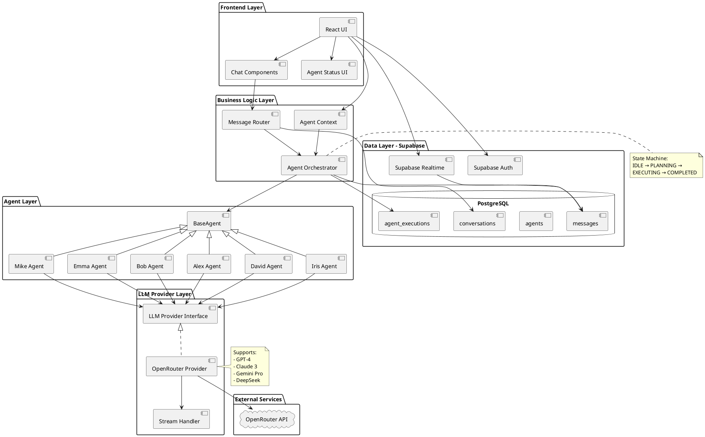
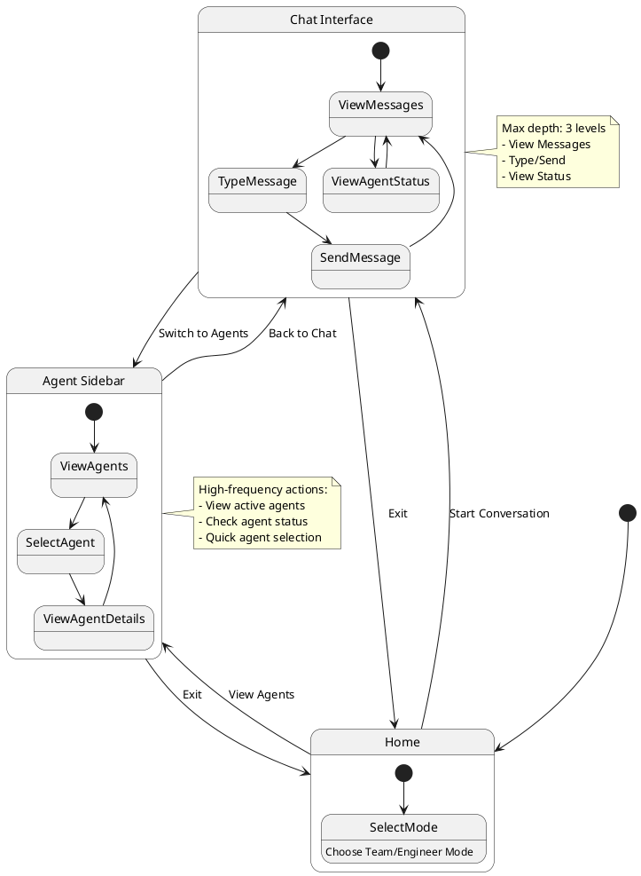
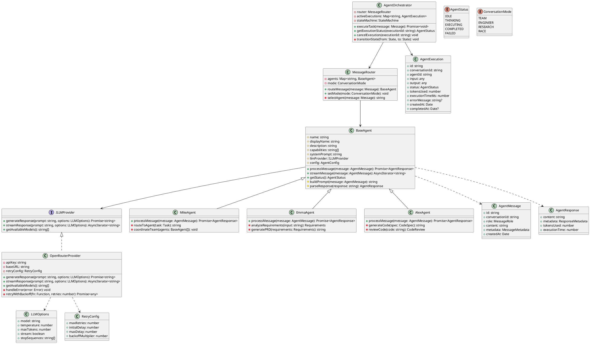
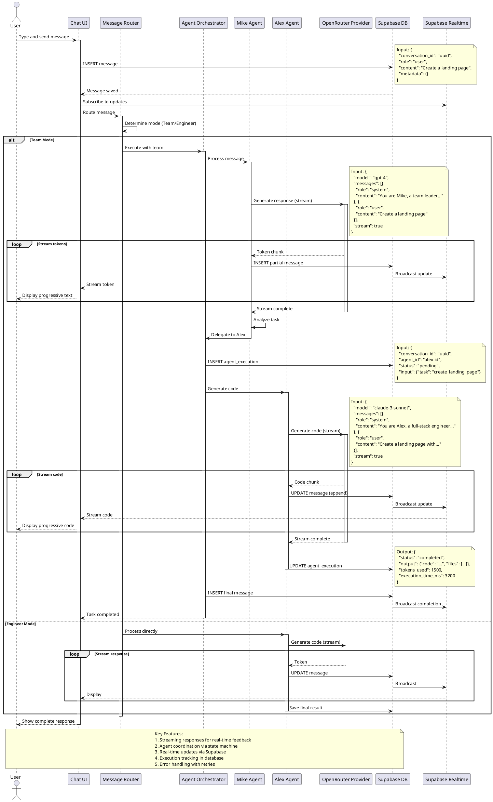
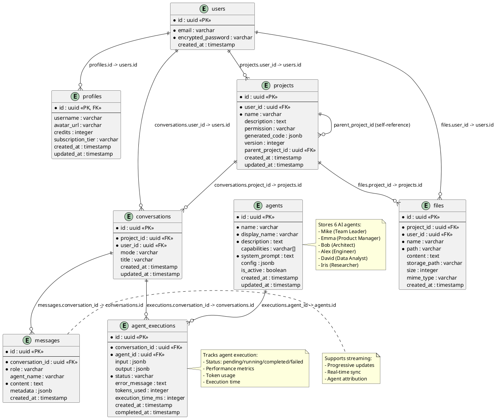

# MGX Demo - M2 AI Agent Integration System Design

## 1. Implementation Approach

### 1.1 Core Architecture
We will implement a multi-agent collaboration system with the following key components:

1. **LLM Provider Abstraction Layer**
   - Create a unified interface for multiple LLM providers (OpenRouter)
   - Support streaming responses for real-time user feedback
   - Implement retry logic with exponential backoff for API failures
   - Handle rate limiting and error recovery

2. **Agent System**
   - Define a BaseAgent class with common functionality
   - Implement 6 specialized agents (Mike, Emma, Bob, Alex, David, Iris)
   - Each agent has unique capabilities and system prompts
   - Support both synchronous and streaming message processing

3. **Message Router & Orchestrator**
   - Route user messages to appropriate agents based on mode (team/engineer)
   - Implement state machine for agent collaboration workflow
   - Handle agent-to-agent communication
   - Track execution status and manage concurrent agent operations

4. **Real-time Integration**
   - Use Supabase Realtime for message synchronization
   - Track agent execution status in real-time
   - Support streaming responses with progressive rendering
   - Handle connection failures and reconnection

5. **State Management**
   - Create AgentContext for managing active agents and their states
   - Track execution progress (idle → thinking → executing → completed/failed)
   - Provide hooks for UI components to react to state changes

### 1.2 Technology Stack
- **LLM API**: OpenRouter (supports GPT-4, Claude, Gemini, DeepSeek)
- **Streaming**: Server-Sent Events (SSE) / Fetch API with streaming
- **State Management**: React Context API + Zustand (optional)
- **Database**: Supabase (PostgreSQL with Realtime)
- **Type Safety**: TypeScript with strict mode

### 1.3 Key Challenges & Solutions
| Challenge | Solution |
|-----------|----------|
| LLM API instability | Multi-provider support with automatic fallback |
| Streaming response handling | Implement SSE parser with buffer management |
| Agent coordination | State machine with clear transition rules |
| Real-time sync | Supabase Realtime with optimistic updates |
| Error recovery | Retry logic with exponential backoff |

## 2. Main User-UI Interaction Patterns

### 2.1 Sending a Message
1. User types message in chat input
2. User presses Enter or clicks Send button
3. Message immediately appears in chat (optimistic update)
4. Message is saved to Supabase database
5. Agent system is triggered via message router

### 2.2 Receiving Agent Response (Streaming)
1. Agent starts processing (status: "thinking")
2. Streaming response begins (status: "executing")
3. Tokens appear progressively in chat bubble
4. User sees real-time typing effect
5. Response completes (status: "completed")
6. Final message is saved to database

### 2.3 Agent Status Visualization
1. Sidebar shows all available agents
2. Active agent is highlighted
3. Agent status indicator shows current state:
   - 🟢 Idle: Ready to process
   - 🟡 Thinking: Analyzing request
   - 🔵 Executing: Generating response
   - ✅ Completed: Task finished
   - ❌ Failed: Error occurred

### 2.4 Mode Switching
1. User clicks mode toggle (Team Mode ↔ Engineer Mode)
2. UI updates to show available agents for selected mode
3. Message routing behavior changes accordingly
4. Previous conversation context is preserved

### 2.5 Error Handling
1. If agent fails, error message is displayed
2. User can click "Retry" button
3. System automatically retries with exponential backoff
4. After max retries, user is notified and can manually retry

## 3. System Architecture

## 4. UI Navigation Flow

## 5. Data Structures and Interfaces

## 6. Program Call Flow

## 7. Database ER Diagram

## 8. Unclear Aspects & Assumptions

### 8.1 Clarifications Needed

1. **LLM Model Selection Strategy**
   - How should the system decide which LLM model to use for each agent?
   - Should users be able to override the default model selection?
   - What's the fallback strategy if the primary model fails?

2. **Agent Coordination Logic**
   - How should Mike determine which agent(s) to delegate tasks to?
   - Should multiple agents work in parallel or sequentially?
   - How to handle conflicts when multiple agents provide different solutions?

3. **Streaming Response Handling**
   - Should partial responses be saved to the database incrementally?
   - How to handle stream interruptions (network issues, user cancellation)?
   - What's the buffer size for streaming tokens?

4. **Cost Management**
   - How to track and limit token usage per user/conversation?
   - Should there be warnings when approaching credit limits?
   - How to handle rate limiting from OpenRouter API?

5. **Error Recovery**
   - What's the maximum number of retries for failed API calls?
   - Should the system automatically switch to a different model on failure?
   - How to present error messages to users without exposing technical details?

### 8.2 Assumptions Made

1. **OpenRouter API Stability**
   - Assuming OpenRouter API has >99% uptime
   - Assuming response times are typically <5 seconds for non-streaming
   - Assuming rate limits are sufficient for MVP usage

2. **Agent Capabilities**
   - Assuming each agent can handle its designated tasks independently
   - Assuming system prompts are sufficient for agent behavior
   - Assuming no need for agent memory beyond conversation context

3. **User Behavior**
   - Assuming users will primarily use Engineer Mode for simple tasks
   - Assuming average conversation length is <50 messages
   - Assuming most users will stay within free tier limits

4. **Technical Constraints**
   - Assuming Supabase free tier is sufficient for MVP
   - Assuming browser supports Server-Sent Events for streaming
   - Assuming TypeScript strict mode is acceptable

5. **Security**
   - Assuming Supabase RLS policies are sufficient for data protection
   - Assuming API keys stored in environment variables are secure
   - Assuming no need for end-to-end encryption of messages

### 8.3 Proposed Solutions

1. **Model Selection**: Implement a configuration-based approach where each agent has a preferred model, with automatic fallback to alternatives.

2. **Agent Coordination**: Start with sequential execution (Mike → Agent → Response), add parallel execution in later iterations.

3. **Streaming**: Save complete messages only, use Realtime for progressive UI updates without database writes for each token.

4. **Cost Management**: Implement client-side token estimation and server-side validation, with warnings at 80% credit usage.

5. **Error Recovery**: Max 3 retries with exponential backoff (1s, 2s, 4s), automatic model switching after 2 consecutive failures.

## 9. Implementation Phases

### Phase 1: Foundation (Week 1)
- [ ] LLM Provider abstraction layer
- [ ] BaseAgent class implementation
- [ ] OpenRouter integration with streaming
- [ ] Basic error handling and retry logic

### Phase 2: Agent Implementation (Week 1-2)
- [ ] Implement all 6 agents (Mike, Emma, Bob, Alex, David, Iris)
- [ ] Define system prompts for each agent
- [ ] Test individual agent responses
- [ ] Optimize prompts based on testing

### Phase 3: Orchestration (Week 2)
- [ ] Message Router implementation
- [ ] Agent Orchestrator with state machine
- [ ] Agent Context for state management
- [ ] Integration with Supabase

### Phase 4: UI Integration (Week 2)
- [ ] Update ChatArea with streaming support
- [ ] Add agent status indicators
- [ ] Implement mode switching UI
- [ ] Add error handling UI

### Phase 5: Testing & Optimization (Week 2)
- [ ] Unit tests for all components
- [ ] Integration tests for agent workflows
- [ ] Performance optimization
- [ ] Documentation and examples

## 10. Success Metrics

| Metric | Target | Measurement |
|--------|--------|-------------|
| Agent Response Time | <3s (non-streaming) | Average time from message send to first token |
| Streaming Latency | <500ms | Time to first token in stream |
| API Success Rate | >95% | Successful API calls / Total calls |
| Agent Task Accuracy | >80% | User satisfaction rating |
| Token Efficiency | <2000 tokens/task | Average tokens used per task |
| System Uptime | >99% | Availability monitoring |

---

**Document Version**: 1.0  
**Last Updated**: 2025-01-28  
**Author**: Bob (System Architect)  
**Reviewers**: Mike (Project Lead), Emma (Product Manager)